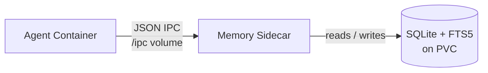
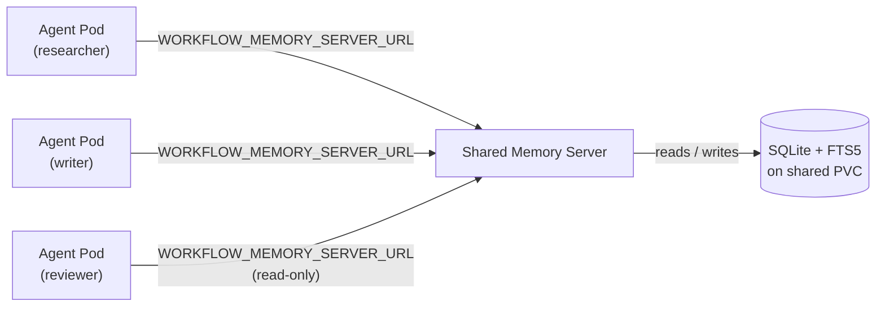

# Persistent Memory

Each `Agent` can enable **persistent memory** — a SQLite database with FTS5 full-text search, served by a memory sidecar that runs alongside agent pods. The database lives on a PersistentVolume, so memory survives across ephemeral agent runs.

Agents interact with memory through these tools exposed via file-based JSON IPC (the same pattern used by MCP tools):

| Tool | Description |
|------|-------------|
| `memory_search(query, top_k?)` | Full-text search across stored memories. Returns the top _k_ results (default 10). |
| `memory_store(content, tags?)` | Store a new memory entry with optional tags for categorisation. |
| `memory_list(tags?, limit?)` | List memories, optionally filtered by tags. |
| `memory_update(id, content, tags?)` | Replace an entry with corrected content. Only the new version appears in search and list. |
| `memory_forget(id)` | Remove an entry from search and list. |

## How It Works

1. The `memory` SkillPack adds a **memory sidecar** (`cmd/memory-server/`) to the agent pod.
2. A **PersistentVolumeClaim** is created per instance to hold `memory.db` — the SQLite database.
3. The agent and memory sidecar share an `/ipc` volume. The agent writes JSON tool requests; the sidecar responds with results.
4. SQLite FTS5 indexes all stored content for fast full-text search.
5. Because the PVC outlives individual pods, memories persist across runs.



## Automatic Memory Storage

When the `memory` SkillPack is attached, the agent-runner **automatically stores a summary of every successful run** — a truncated `Task: … / Response: …` entry tagged `auto` and `agent-run` — so future runs have context without the agent having to call `memory_store` explicitly.

### Opting out

Some teams prefer to curate memory deliberately rather than log every run. Set `autoStore: false` to disable the automatic write while **keeping the memory skill and its `memory_store` tool** for manual/curated entries — only the automatic per-run write stops.

On a single `Agent`:

```yaml
apiVersion: sympozium.ai/v1alpha1
kind: Agent
metadata:
  name: my-agent
spec:
  skills:
    - skillPackRef: memory
  memory:
    autoStore: false   # keep the skill, stop the automatic per-run write
```

On an `Ensemble` — `autoStoreMemory` sets the team-wide default, overridable per member via `agentConfigs[].memory.autoStore`:

```yaml
apiVersion: sympozium.ai/v1alpha1
kind: Ensemble
metadata:
  name: research-team
spec:
  autoStoreMemory: false        # default for every generated agent
  agentConfigs:
    - name: archivist
      memory:
        autoStore: true          # this member still auto-stores (overrides the default)
```

Precedence: per-agent-config `memory.autoStore` → ensemble `autoStoreMemory` → default (`true`). Omitting the field everywhere preserves the existing auto-store behaviour.

### Tuning truncation limits

Auto-stored entries are truncated to keep the database small. The byte limits default to **500 bytes** (task) and **1000 bytes** (response) and can be overridden per pod via environment variables (set through `spec.agents.default.env` on the Agent, or `env` on an ensemble agent-config):

| Env var | Default | Effect |
|---------|---------|--------|
| `MEMORY_AUTO_STORE_MAX_TASK_BYTES` | `500` | Max stored bytes of the task; a value ≤ 0 disables task truncation |
| `MEMORY_AUTO_STORE_MAX_RESPONSE_BYTES` | `1000` | Max stored bytes of the response; a value ≤ 0 disables response truncation |
| `MEMORY_AUTO_STORE` | `true` | Set to `false` to disable auto-store directly (the controller sets this from `memory.autoStore`) |

Setting `MEMORY_AUTO_STORE` yourself through `spec.agents.default.env` (or an ensemble agent-config's `env`) also works, and an explicit env var wins over `memory.autoStore` — the controller skips its own injection when the pod already carries the variable. That matches every other controller-injected variable (`RUN_TIMEOUT`, `MEMORY_SERVER_URL`, and so on): `spec.env` is the last word. Prefer `memory.autoStore` for anything declarative, since the env var is per-pod and invisible to the Agent/Ensemble spec.

## Correcting and Forgetting

Memory storage is **append-only**. A stored row is never changed. Each row is one **version** of a memory:

- `id` is the memory's id. It is shared by all versions, so an agent keeps using the same id after an update.
- `seq` is a global, always-increasing sequence number. The version with the highest `seq` for an `id` is the **current version**.
- `content` is `NULL` for a forget.

The tools add versions:

- `memory_update(id, content, tags?)` adds a version with the new content.
- `memory_forget(id)` adds a version with `NULL` content.

Search, list and provenance only see the current version of each memory, and only if it has content. So after an update, only the new content is found. After a forget, the memory is not found at all. The full-text index holds exactly these current versions: database triggers move the index to the new version on every write, so old content cannot match a search.

Rules the memory server enforces:

- A forgotten memory cannot be updated or forgotten again (`409 Conflict`). Store a new entry instead.
- An update keeps the memory's `visibility` and `parent_id`. Omitted `tags` and `evidence` are kept too. Sending `"evidence": null` or `{}` clears the evidence.
- An update sets `created_at` to the time of the update. The memory has been confirmed as of now, so time decay (`maxAge`) counts from the update.
- In shared workflow memory, a persona can only update or forget entries it stored itself. The agent-runner always sets the source agent to the persona name; the model cannot choose it. Entries stored before this release without a membrane have no source agent, so no persona can change them; use the admin endpoints below.
- `parent_id` refers to a memory id, so provenance shows the current version of each parent and leaves out forgotten ones.

The server endpoints are `POST /update` (`{"id", "content", "tags?", "evidence?"}`) and `POST /forget` (`{"id"}`).

### Auditing history

Because nothing is overwritten, the full history of every memory is kept. The admin-only `GET /history?id=N` endpoint returns every version of memory `N` in `seq` order, including replaced and forgotten content (forget versions have `"forgotten": true`). It uses the same bearer token as `DELETE /delete` (`memory.adminDelete.enabled` in the Helm chart) and is never exposed to agent pods:

```bash
kubectl port-forward svc/<agent>-memory 8080:8080
curl -H "Authorization: Bearer $TOKEN" "http://localhost:8080/history?id=42"
```

To remove content for good, use `DELETE /delete?id=N` (every version of memory `N`) or `DELETE /delete?id=N&seq=S` (one version). Deleting the current version makes the previous version current again, and searchable.

## Enabling Memory

Add the `memory` SkillPack to your instance's skills list:

```yaml
apiVersion: sympozium.ai/v1alpha1
kind: Agent
metadata:
  name: my-agent
spec:
  agents:
    default:
      model: gpt-4o
  skills:
    - skillPackRef: memory
```

Or reference it from an Ensemble:

```yaml
apiVersion: sympozium.ai/v1alpha1
kind: Ensemble
metadata:
  name: sre-watchdog
spec:
  agentConfigs:
    - name: sre-watchdog
      systemPrompt: |
        You are an SRE watchdog. Monitor the cluster and track recurring issues.
      skills:
        - k8s-ops
        - memory
      memory:
        enabled: true
        seeds:
          - "Track recurring issues for trend analysis"
          - "Note any nodes that frequently report NotReady"
```

Seed memories are inserted into the SQLite database when the instance is first created.

## SkillPack Configuration

The memory SkillPack is defined at `config/skills/memory.yaml`. It follows the standard SkillPack pattern — Markdown instructions mounted at `/skills/` plus a sidecar container:

- **Skills layer:** Instructions that teach the agent when and how to use `memory_search`, `memory_store`, `memory_list`, `memory_update`, and `memory_forget`.
- **Sidecar layer:** The `memory-server` container that manages the SQLite database and responds to IPC requests.
- **No RBAC required:** The memory sidecar only accesses its own PVC — it does not talk to the Kubernetes API.

## Data Persistence

| Aspect | Detail |
|--------|--------|
| **Storage** | One PVC per instance, named `<instance>-memory` |
| **Database** | SQLite 3 with FTS5 extension |
| **Lifecycle** | PVC persists until the Agent is deleted (or manually removed) |
| **Backup** | Standard PV backup tools apply (Velero, volume snapshots, etc.) |
| **Upgradeable** | The SQLite schema is designed to support a future upgrade path to vector search |

## Viewing Memory

View an agent's stored memories through the TUI:

```
/memory <instance-name>
```

Or query the database directly by exec-ing into the memory sidecar during a run:

```bash
kubectl exec <pod> -c memory-server -- sqlite3 /data/memory.db "SELECT content, tags FROM memories ORDER BY created_at DESC LIMIT 10;"
```

A direct query like this shows every row, including replaced versions and forget versions (`NULL` content). See [Auditing history](#auditing-history).

## Shared Workflow Memory

When agents work together in a **Ensemble**, each persona has its own private memory by default. **Shared Workflow Memory** adds a pack-level memory pool that all personas can access, enabling team knowledge accumulation.

### Private vs Shared Memory

| Aspect | Private Memory | Shared Workflow Memory |
|--------|---------------|----------------------|
| **Scope** | One instance | All personas in an Ensemble |
| **Storage** | `<instance>-memory-db` PVC | `<pack>-shared-memory-db` PVC |
| **Tools** | `memory_search`, `memory_store`, `memory_list` | `workflow_memory_search`, `workflow_memory_store`, `workflow_memory_list` |
| **Access** | Always read-write | Per-persona: `read-write` or `read-only` |
| **Attribution** | N/A (single owner) | Auto-tagged with source persona name |
| **Auto-context** | Top 3 results injected as "Your Past Findings" | Top 3 results injected as "Team Knowledge" |

### Enabling

Add `sharedMemory` to the Ensemble spec:

```yaml
apiVersion: sympozium.ai/v1alpha1
kind: Ensemble
metadata:
  name: research-delegation-example
spec:
  # Define your personas here (researcher and reviewer in this example)
  agentConfigs: []
  sharedMemory:
    enabled: true
    storageSize: "1Gi"
    accessRules:
      - agentConfig: researcher
        access: read-write
      - agentConfig: reviewer
        access: read-only
```

### Infrastructure

The Ensemble controller provisions three Kubernetes resources:



- **PVC**: `<pack>-shared-memory-db` — `ReadWriteOnce`, single replica
- **Deployment**: `<pack>-shared-memory` — same `skill-memory` image, `Recreate` strategy
- **Service**: `<pack>-shared-memory` — ClusterIP on port 8080

Agent pods receive two env vars:
- `WORKFLOW_MEMORY_SERVER_URL` — points to the shared memory service
- `WORKFLOW_MEMORY_ACCESS` — `read-write` or `read-only` (from access rules)

A `wait-for-shared-memory` init container ensures the server is ready before the agent starts.

### Tools

| Tool | Description |
|------|-------------|
| `workflow_memory_search(query, top_k?)` | Full-text search across all team knowledge |
| `workflow_memory_store(content, tags?)` | Store findings for other personas (auto-tagged with source persona) |
| `workflow_memory_list(tags?, limit?)` | List entries, filterable by tag or persona |
| `workflow_memory_update(id, content, tags?, evidence?)` | Correct an entry this persona stored. Omitted `evidence` is kept; `{}` clears it (see [Correcting and Forgetting](#correcting-and-forgetting)) |
| `workflow_memory_forget(id)` | Remove an entry this persona stored from search and list |

The `workflow_memory_store`, `workflow_memory_update` and `workflow_memory_forget` tools are only available to personas with `read-write` access. The source persona name is automatically added as a tag for attribution.

### Synthetic Membrane

The **Synthetic Membrane** is an optional layer on top of Shared Workflow Memory that adds selective permeability, provenance tracking, token budgets, circuit breakers, and time decay. It transforms the flat shared memory pool into a structured medium where agents share state selectively.

Add a `membrane` block inside `sharedMemory`:

```yaml
spec:
  sharedMemory:
    enabled: true
    storageSize: "1Gi"
    membrane:
      defaultVisibility: public
      permeability:
        - agentConfig: researcher
          defaultVisibility: trusted
          exposeTags: ["findings"]
        - agentConfig: reviewer
          defaultVisibility: private
      trustGroups:
        - name: content-team
          agentConfigs: ["researcher", "writer"]
      tokenBudget:
        maxTokens: 100000
        action: halt
      circuitBreaker:
        consecutiveFailures: 3
      timeDecay:
        ttl: "168h"
```

Key capabilities:

| Feature | What it does |
|---------|-------------|
| **Permeability** | Three-tier visibility (public/trusted/private) per persona with tag-level selectivity |
| **Trust groups** | Named groups of personas that can see each other's "trusted" entries |
| **Token budget** | Caps total token consumption across all runs; halts or warns on breach |
| **Circuit breaker** | Opens after N consecutive delegation failures, blocking further spawns |
| **Time decay** | Excludes old entries from search results via configurable TTL |
| **Provenance** | Every entry tracks its source agent and derivation chain via `parent_id`. The chain shows the current version of each entry and leaves out forgotten ones. |

When the membrane is configured, agent pods receive additional env vars (`WORKFLOW_MEMBRANE_VISIBILITY`, `WORKFLOW_MEMBRANE_TRUST_PEERS`, `WORKFLOW_MEMBRANE_ACCEPT_TAGS`, `WORKFLOW_MEMBRANE_MAX_AGE`) that the agent runner uses to filter store and search calls automatically.

See [Ensembles — Synthetic Membrane](ensembles.md#synthetic-membrane) for full configuration reference.

!!! tip "Further Reading"
    The membrane design is based on the [Synthetic Membrane](https://zenodo.org/records/20070699) research paper: *"The Synthetic Membrane: A Shared Permeable Boundary for Multi-Agent AI Systems"* (April 2026).

### Viewing Shared Memory

Query the shared memory via the API:

```bash
curl -H "Authorization: Bearer $TOKEN" \
  http://localhost:9090/api/v1/ensembles/research-delegation-example/shared-memory
```

Or exec into the shared memory pod:

```bash
kubectl exec deploy/research-delegation-example-shared-memory -c memory-server -- \
  sqlite3 /data/memory.db "SELECT content, tags FROM memories ORDER BY created_at DESC LIMIT 10;"
```

## Migration from ConfigMap Memory (Legacy)

The previous ConfigMap-based memory system (`<instance>-memory` ConfigMap with `MEMORY.md`) is preserved as a **legacy fallback**. If an instance has `spec.memory.enabled: true` but does not include the `memory` SkillPack, the controller falls back to the ConfigMap approach.

To migrate:

1. Add `memory` to the instance's skills list.
2. Existing ConfigMap memories can be imported by storing them via `memory_store` during the first run — the agent's skill instructions include guidance for this.
3. Once migrated, you can disable the legacy ConfigMap by removing `spec.memory.enabled` or setting it to `false`.

Both systems can coexist during the transition period. The memory sidecar takes precedence when both are present.
